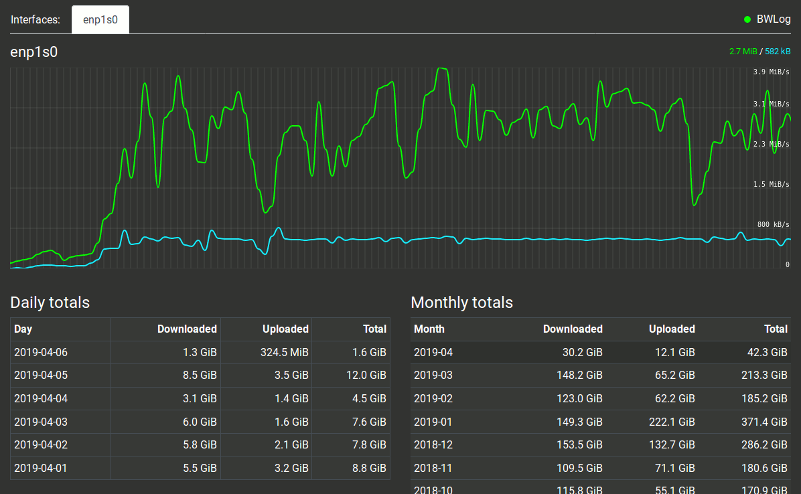

# BWLog - Lightweight bandwidth logger for *nix

A lightweight bandwidth logger written in Go. The tool logs the incoming and outgoing network
traffic from each of the specified network interfaces, and provides a web frontend to view
both a live graph and statistics history for each interface.




## Usage options

```shell
Options:
  -d string
        database directory path
  -i string
        interfaces to monitor, comma separated eg: eth0,eth1
  -l string
        port to listen on (default "0.0.0.0:8080")
  -p string
        basic auth password file (must contain a single <user>:<pass>)
  -s int
        save to database every X seconds (default 60)
  -sslcert string
        Path to SSL certificate (must be used together with sslkey)
  -sslkey string
        Path to private SSL key (must be used together with sslcert)
  -u    update to latest release
  -v    show version number
```


## Running BWLog

```shell
bwlog -i eth0,docker0 -d ~/bwlog/ -p ~/bwlog/auth
```

See `bwlog -h` for options.

Unless you have specified different listening options, you should be able to connect to `127.0.0.1:8080`
with your web browser.


## Basic auth

If you want to use basic auth, simply create a file with two words in it, your username and password, eg:
```
MyUser MySecretPass
```
Then just add `-p <password_file>` to your startup flags. BWLog does not handle multiple users/passwords.


## HTTPS

To enable HTTPS you must use both the `-sslcert` and `-sslkey` options to specify the respective certificate files.


## Compiling

Ensure you have `golang` and `make` installed, then just:

```shell
make
```


## Integrate with systemd

BWLog does not have a background daemon. If you want bwlog to run automatically in the background then you can
easily integrate this with systemd.

Create a file `/etc/systemd/system/bwlog.service`, ensuring sure you modify the  `ExecStart` to your requirements.

```
[Unit]
Description=BWLog

[Service]
ExecStart=/usr/local/bin/bwlog -d /opt/bwlog/ -i eth0,eth1
Restart=always
RestartSec=10
# Output to syslog
StandardOutput=syslog
StandardError=syslog
SyslogIdentifier=bwlog

[Install]
WantedBy=multi-user.target
```

Enable the service: `systemctl enable bwlog.service`

Start the service: `systemctl start bwlog.service`

If you make changes to `/etc/systemd/system/bwlog.service` you will need to `systemctl daemon-reload`
before restarting the service.


## TODOs

There are some other things I'd like to do at some stage if I ever get inspired and have some time:

- Switch to vue.js
