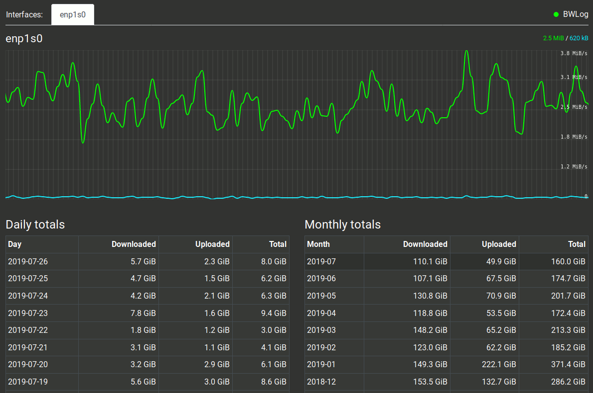

# BWLog - Lightweight bandwidth logger

A lightweight bandwidth logger written in Go. The tool logs the incoming and outgoing network traffic from each
of the set network interfaces to a sqlite database, and provides a web frontend to view both a live graph and
statistics history for each monitored interface.




## Usage options

```
Usage of bwlog:
  -d string
        database path (default "./bwlog.sqlite")
  -i string
        interfaces to monitor, comma separated (default "eth0")
  -l string
        port to listen on (default "0.0.0.0:8080")
  -s int
        save to database every X seconds (default 60)
```


## Running BWLog

`bwlog -i eth0,docker0 -d ~/bwlog.sqlite`


## Compiling

Ensure you have `golang`, `gcc` (for go-sqlite3) and `make` installed, then just:

`make`


## Cross compiling

I haven't had much luck cross compiling as `mattn/go-sqlite3` is a CGO enabled package, so requires a valid `gcc`
compiler for that required platform/architecture installed. I'm sure there are ways of doing it, but I gave up.
